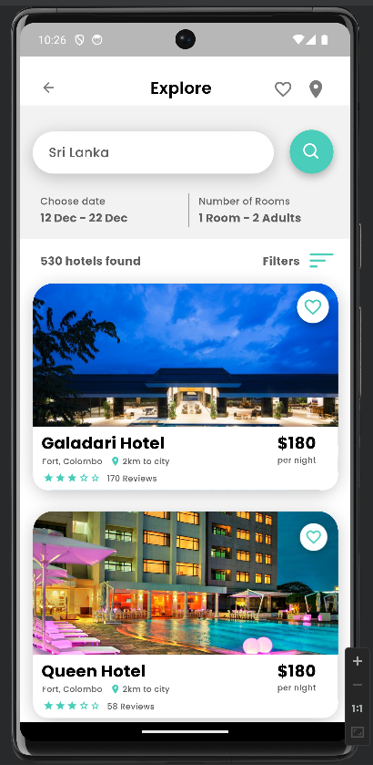
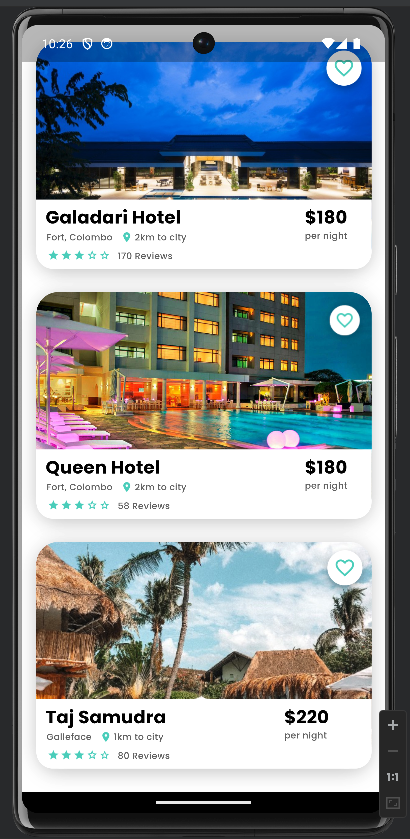

# Hotel Booking App

This project is a hotel booking application developed with Flutter. It showcases the use of custom, reusable card widgets to display hotel information efficiently. The project emphasizes the following key features and learnings:

## Key Features

- **Reusable Card Widgets**: Designed custom widgets to represent hotel cards, making the UI components modular and reusable.
- **Dynamic Data Display**: Each hotel card displays dynamic information such as hotel name, location, distance from the city, price per night, and user reviews.
- **Search and Filter**: Includes search functionality and filters to enhance user experience in finding and booking hotels.
- **Responsive Design**: Ensures the app works seamlessly across different devices and screen sizes.

## Lessons Learned

- **Widget Hierarchy and Composition**: Gained a deep understanding of Flutter's widget system to build complex layouts from simple widgets.
- **Debugging and Error Handling**: Improved skills in debugging and resolving issues in Flutter applications.
- **UI Design with Figma**: Learned to design UI components in Figma, export code, and integrate it into Android Studio.
- **Using Flutter Libraries**: Leveraged pre-built components from the Flutter library to speed up development and maintain a consistent design.

## Summary

The Hotel Booking App project demonstrates how to effectively use Flutter's widget-based architecture to create a modular and scalable mobile application. By focusing on reusable components, the project achieves a clean and maintainable codebase, making it easier to update and expand in the future.

## UI Screenshots

Below are some screenshots of the application's user interface:

  
  
  

